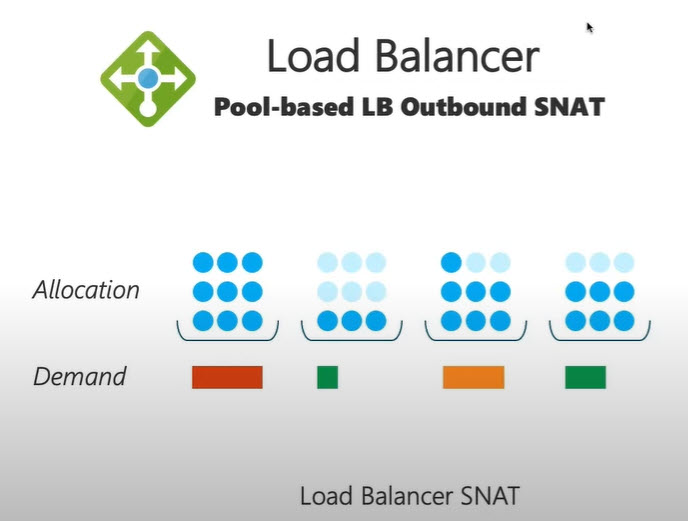
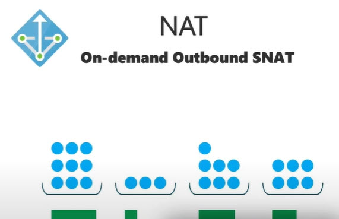

# NAT Gateway

## NAT Gateway - Network Address Translation
- link
  - [azure friday](https://www.youtube.com/watch?v=2Ng_uM0ZaB4)  
  - [ms learn](https://learn.microsoft.com/en-us/azure/virtual-network/nat-gateway/nat-overview)
  - https://aka.ms/natresource
  - https://aka.ms/natdebug
  - https://aka.ms/natmetrics
- Glossary
  - SNAT = Source NAT
  - PAT = Port Address
- without nat gateway
  - preallocate SNAT across subnet, One machine can run out of SNAT port, while others see no issues
  - low on stack, not change allocation. App Can't see the issue
  - won't get full SNAT ports unless you have public IP assigned. depend on service/product get different values
  - when out of SNAT ports, connections timeout.
- when added, it will reconfigure subnet to use it. No need to change/add route.
- demo shows, no downtime when reconfig subnet
- performance
  - can support `50k concurrent connection` per ip
  - 50 Gbps throughput
  - On Demain outbound SNAT
  - support 2 million connection at one time
  - can support 16 public IPs (IP Prefix can set 2,4,8,16)
- Restrictions
  - NAT Can associate to multiple subnets
  - subnet Can't associate to multiple NAT
  - basic resources (IP, load balancers) not supported by NAT need to upgrade to standard
  - NAT can only add networks in same region
  - IP Prefix can addd up to 16 IPs.
- config
  - idle timeout? default 4 mins 4-120. choose as low as needed
  - how any IP? 
- arm/bicep 
  - create NAT Gateway simple
  - Associate to NAT Gateway is ugly. After create nat, need to update network/subnets/peering to use NAT

