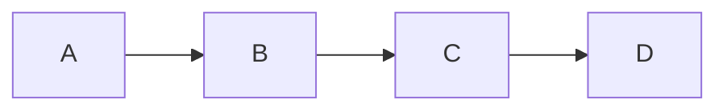
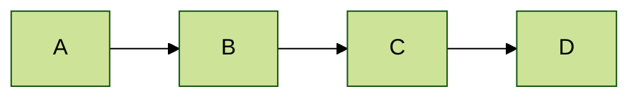
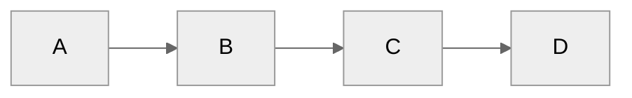
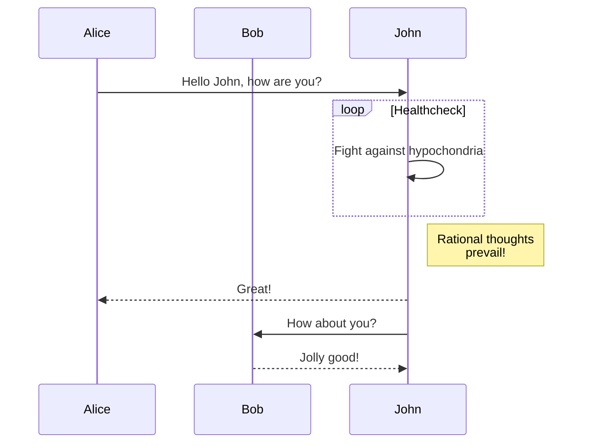
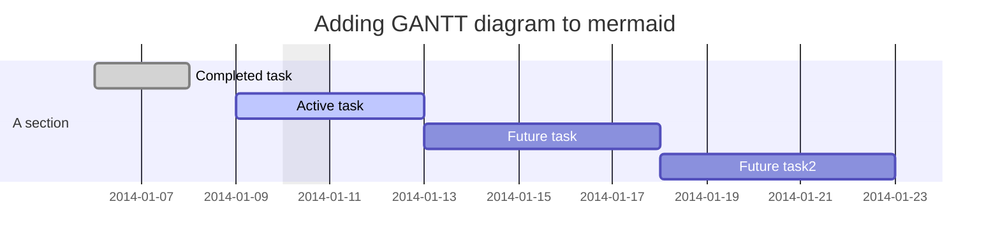
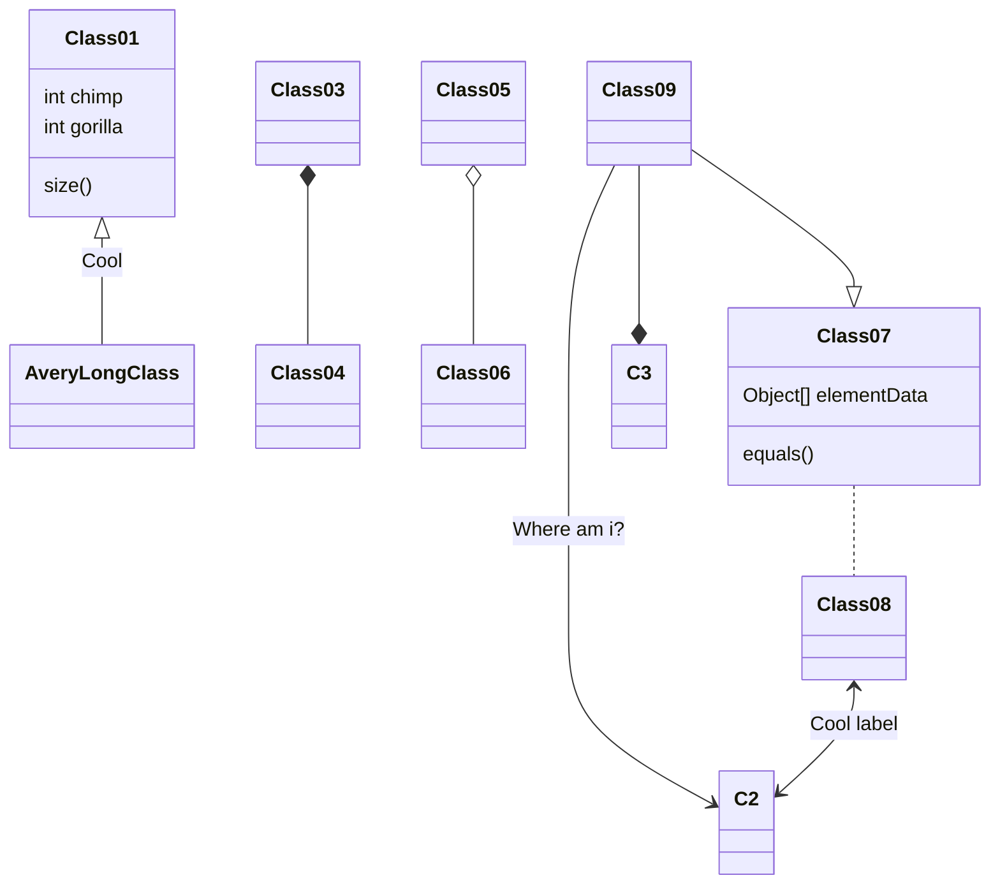
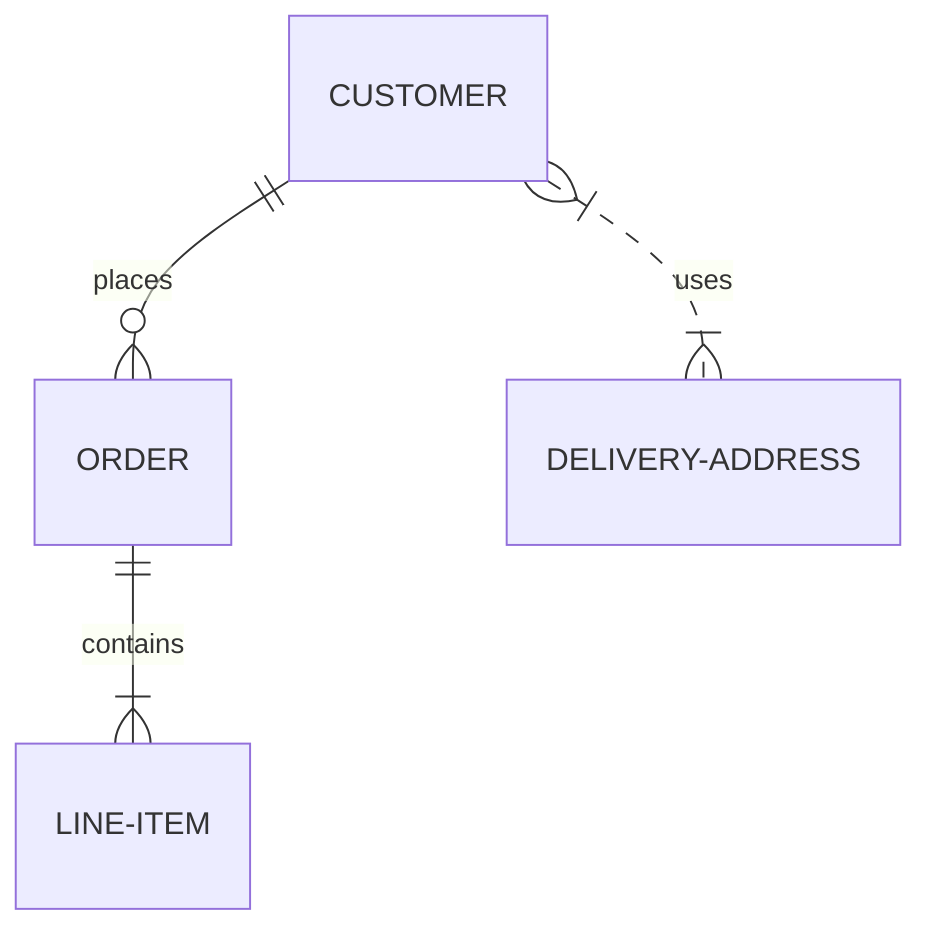
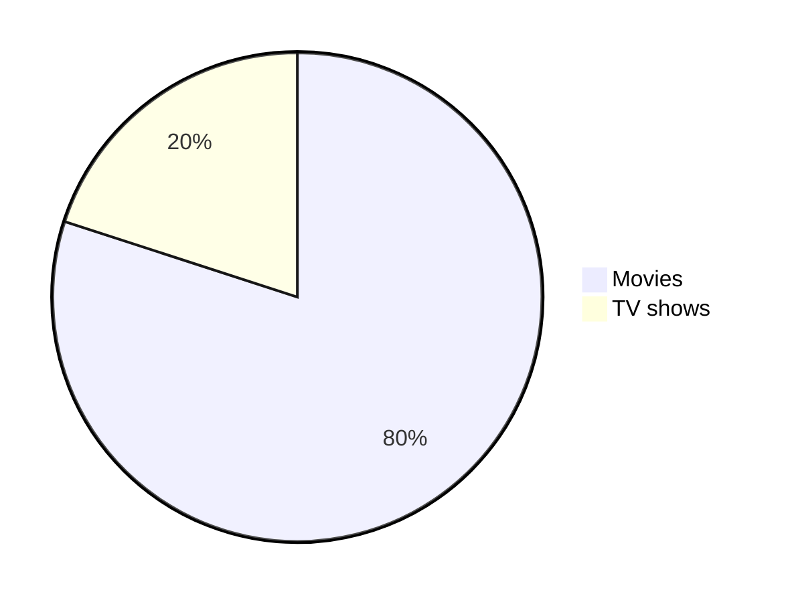

# Mermaid
https://mermaid-js.github.io/mermaid/#/

## Usage
````markdown
```mermaid
[Code]
```
````

## Change Colors
mermaid-theme: default, base, dark, forest, neutral, night

```
%%{init: {'theme': 'forest' } }%%
graph LR;
    A-->B;
    B-->C;
    C-->D;
```
<table>
<tr><th> Theme </th> <th> demo </th> </tr>
<tr><td> default </td> <td>  


</td> </tr>
<tr><td> forest </td> <td>  


</td> </tr>
<tr><td> neutral </td> <td>  


</td> </tr>
</table>

## Flow Chart
```
graph TD;
    A-->B;
    A-->C;
    B-->D;
    C-->D;
```


## Sequence diagram
```
sequenceDiagram
    participant Alice
    participant Bob
    Alice->>John: Hello John, how are you?
    loop Healthcheck
        John->>John: Fight against hypochondria
    end
    Note right of John: Rational thoughts <br/>prevail!
    John-->>Alice: Great!
    John->>Bob: How about you?
    Bob-->>John: Jolly good!
```


## Gantt diagram
```
gantt
dateFormat  YYYY-MM-DD
title Adding GANTT diagram to mermaid
excludes weekdays 2014-01-10

section A section
Completed task            :done,    des1, 2014-01-06,2014-01-08
Active task               :active,  des2, 2014-01-09, 3d
Future task               :         des3, after des2, 5d
Future task2               :         des4, after des3, 5d
```


## Class diagram
```
classDiagram
Class01 <|-- AveryLongClass : Cool
Class03 *-- Class04
Class05 o-- Class06
Class07 .. Class08
Class09 --> C2 : Where am i?
Class09 --* C3
Class09 --|> Class07
Class07 : equals()
Class07 : Object[] elementData
Class01 : size()
Class01 : int chimp
Class01 : int gorilla
Class08 <--> C2: Cool label
```


## ERD
```
erDiagram
    CUSTOMER ||--o{ ORDER : places
    ORDER ||--|{ LINE-ITEM : contains
    CUSTOMER }|..|{ DELIVERY-ADDRESS : uses
```


<!-- 
## Name
```

```
```mermaid

``` -->


## Pie Chart
```
pie
"Movies" : 80
"TV shows" : 20
```


