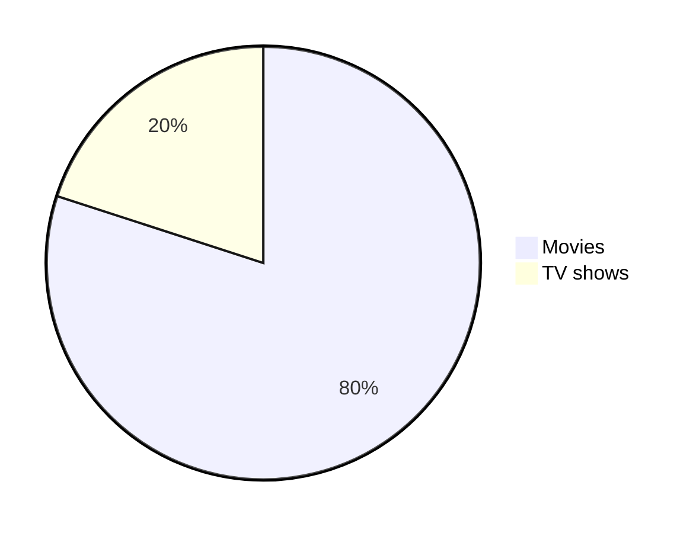

# Cheat-Sheet

Markdown is a text-to-HTML conversion tool for web writers. Markdown allows you to write using an easy-to-read, easy-to-write plain text format, then convert it to structurally valid XHTML (or HTML).

Documentation: [Markdown Docs](https://daringfireball.net/projects/markdown/)
RFC: [RFC 7763](https://www.rfc-editor.org/rfc/rfc7763)
GitHub Documentation: [Writing Markdown on GitHub](https://docs.github.com/en/get-started/writing-on-github)
Link: [markdown guide](https://www.markdownguide.org/cheat-sheet)

---

## Headings
```markdown
# Heading 1
## Heading 2
### Heading 3
#### Heading 4
##### Heading 5
###### Heading 6
```
Here is a heading: `# Heading`, **don't do this:** `#Heading` 
# Heading 1
## Heading 2
### Heading 3
#### Heading 4
##### Heading 5
###### Heading 6

### Heading ID
```markdown
#### Heading ID Example {#custom-id}
```
#### Heading ID Example {#custom-id}

### Link to Heading ID
```markdown
[Heading IDs](#custom-id)
```
[Heading IDs](#custom-id)

---


## Emphasis
```markdown
Emphasis, aka italics, with *asterisks* or _underscores_.  
Strong emphasis, aka bold, with **asterisks** or __underscores__.  
Combined emphasis with **asterisks and _underscores_**.  
Strikethrough uses two tildes. ~~Scratch this~~.  
```
Emphasis, aka italics, with *asterisks* or _underscores_.  
Strong emphasis, aka bold, with **asterisks** or __underscores__.  
Combined emphasis with **asterisks and _underscores_**.  
Strikethrough uses two tildes. ~~Scratch this~~.  

## Text Highlight
```markdown
<mark>Highlighted text</mark>  
==Highlighted text2==
```
<mark>Highlighted text</mark>  
==Highlighted text2==
## Line Breaks
```markdown
First line with two spaces after.  
And the next line.
```
---
## Lists

### Ordered Lists
```markdown
1. First item
2. Second item
3. Third item
```
1. First item
2. Second item
3. Third item

### Unordered Lists
```markdown
- First item
- Second item
- Third item
```
- First item
- Second item
- Third item

### Definition Lists
```markdown
First Term
: This is the definition of the first term.

Second Term
: This is one definition of the second term.
: This is another definition of the second term.
```
First Term
: This is the definition of the first term.

Second Term
: This is one definition of the second term.
: This is another definition of the second term.
## Horizontal Rule
```markdown
> Blockquotes are very handy in email to emulate reply text.
> This line is part of the same quote.
```
> Blockquotes are very handy in email to emulate reply text.  
> This line is part of the same quote.


## Blockquotes
```markdown
Three or more Hyphens/Asterisks/Underscores

---
***
___

```
Three or more Hyphens/Asterisks/Underscores

---
***
___

## SuperScript SubScript
```markdown
E=MC<sup>2</sup>
CO<sub>2</sub>

E=mc^2^
CO~2~
```
E=MC<sup>2</sup>
CO<sub>2</sub>

E=mc^2^
CO~2~

### Math Expression
```markdown
This is an inline math expression $x = {-b \pm \sqrt{b^2-4ac} \over 2a}$

$$
x = {-b \pm \sqrt{b^2-4ac} \over 2a}
$$
```
This is an inline math expression $x = {-b \pm \sqrt{b^2-4ac} \over 2a}$

$$
x = {-b \pm \sqrt{b^2-4ac} \over 2a}
$$

## Comments
```markdown
<!---
comments syntax
--->
```
<!---
comments syntax
--->
### Diagram
````markdown

````


## Links
```markdown
Link: (https://www.google.com)  
Link with text: [link-text](https://www.google.com)  
```
Link: (https://www.google.com)  
Link with text: [link-text](https://www.google.com)  


## Images
```markdown
Image with alt text: 

```
Image with alt text: 


## Code Blocks

### Inline Code Block
```markdown
Inline `code` has `back-ticks around` it.
```
Inline `code` has `back-ticks around` it.


### Blocks of Code
```markdown
```python
s = "Python syntax highlighting"
print s
```
 
```python
s = "Python syntax highlighting"
print s
```
 
## Tables

There must be at least 3 dashes separating each header cell.
The outer pipes (|) are optional, and you don't need to make the raw Markdown line up prettily.
```markdown
| Heading 1 | Heading 2 | Heading 3 |
|---|---|---|
| col1 | col2 | col3 |
| col1 | col2 | col3 |

```
| Heading 1 | Heading 2 | Heading 3 |
|---|---|---|
| col1 | col2 | col3 |
| col1 | col2 | col3 |

### table Alignment
```markdown
| Syntax      | Description | Test Text     |
| :---        |    :----:   |          ---: |
| Header      | Title       | Here's this   |
| Paragraph   | Text        | And more      |
```
| Syntax      | Description | Test Text     |
| :---        |    :----:   |          ---: |
| Header      | Title       | Here's this   |
| Paragraph   | Text        | And more      |

## Task list

To create a taksk lsit start line with square brackets with an empty space.
Ex: [ <space> ] and add text for task.
To check the task replace the space between the bracket with "x".

```markdown
- [x] Write the post
- [ ] Update the website
- [ ] Contact the user
```
- [x] Write the post
- [ ] Update the website
- [ ] Contact the user

## Footnotes
```markdown
Here's a simple footnote,[^1] and here's a longer one.[^bignote]

[^1]: This is the first footnote.

[^bignote]: Here's one with multiple paragraphs and code.

    Indent paragraphs to include them in the footnote.

    `{ my code }`

    Add as many paragraphs as you like.
```
Here's a simple footnote,[^1] and here's a longer one.[^bignote]

[^1]: This is the first footnote.

[^bignote]: Here's one with multiple paragraphs and code.

    Indent paragraphs to include them in the footnote.

    `{ my code }`

    Add as many paragraphs as you like.
